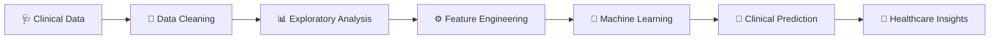

# 🧬👩🏽‍🔬 Fiona Githaiga  
## Clinical Data Scientist | Bioinformatics Researcher | Molecular Biologist


<p align="center">


</p>


<p align="center">

🧪 🔬 🧬 💻 🤖 📊 🏥

</p>


---

## 🧑🏽‍🔬 About Me


```text
          🧬 Biology

              +

          📊 Data Science

              +

          🤖 Artificial Intelligence

              +

          🏥 Medicine


              =


     Precision Healthcare 🚀
````

I am a **Clinical Data Scientist** with a background in **Molecular Biology, Immunology, Diagnostics, and Translational Research**.

I build computational solutions that connect:

🧫 Laboratory discoveries
📈 Clinical datasets
🤖 Machine learning models
🧬 Biological insights

---

# 🔬 Research Identity

🧬 Precision Medicine
🧫 Immunology
🧬 Cancer Biology
🩺 Clinical Analytics
🔍 Biomarker Discovery
🧪 Molecular Diagnostics
📊 Biomedical Data Science

---

# 💻 Data Science Toolkit

## 🐍 Programming


---

# 🤖 Machine Learning Workflow



---

# 🧬 Featured Projects

## ❤️ Cardiovascular Disease Causal Inference

```
Lifestyle Factors 🚬🏃

          ↓

Clinical Risk ❤️

          ↓

DAG Models 🔗

          ↓

Propensity Matching 📊

          ↓

Causal Conclusions 🧠
```

Tools:

```
R
tidyverse
ggplot2
MatchIt
Causal Inference
```

---

## 🧬 Clinical Genomics Explorer

```
DNA 🧬

 ↓

RNA 🧫

 ↓

Expression Data 📊

 ↓

Machine Learning 🤖

 ↓

Biomarkers 🔎
```

Tools:

```
R
Python
Bioconductor
GEO
Single-cell Analysis
```

---

## 📊 Interactive Clinical Data Visualization

```
        Patient Data

             👩🏽‍⚕️

        📈 📊 📉

             ↓

       Clinical Insight

```

Tools:

```
GWalkR
ggplot2
Tableau
Plotly
```

---

# 🧰 Technology Stack

| Field            | Tools              |
| ---------------- | ------------------ |
| Programming      | Python 🐍 R 📊 SQL |
| Statistics       | R Stats, SciPy     |
| Machine Learning | Scikit-learn       |
| Visualization    | ggplot2, Tableau   |
| Bioinformatics   | Bioconductor       |
| Version Control  | GitHub             |

---

# 📚 Currently Learning

🌱 Deep Learning for Healthcare

🌱 Single-cell RNA Sequencing

🌱 Multi-omics Integration

🌱 AI-assisted Diagnosis

🌱 Advanced Causal Inference

---

# 📈 GitHub Analytics

<p align="center">


</p>

<p align="center">


</p>

---

# 🧪 Scientist Mode Activated

```
        👩🏽‍🔬
       /|\
      / | \
     🧬 💻 📊


"Where biology meets data"

```

---

# 🤝 Connect

💼 LinkedIn:

[https://www.linkedin.com/in/fiona-githaiga-3282aa194/](https://www.linkedin.com/in/fiona-githaiga-3282aa194/)

💻 GitHub:

[https://github.com/FionaG26](https://github.com/FionaG26)

---

<p align="center">

⭐ Building the future of healthcare using

🧬 Biology + 📊 Data + 🤖 AI

</p>
